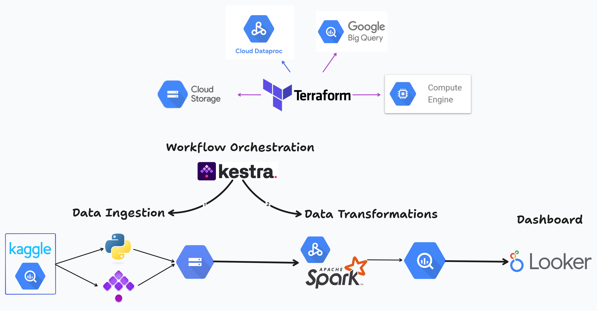

# Crypto Transaction Analysis

This project, developed for the Data Engineering Zoomcamp 2025 Cohort, ingests cryptocurrency activity data in batches and produces a dashboard for analysis.

- [Crypto Transaction Analysis](#crypto-transaction-analysis)
  - [Problem Statement](#problem-statement)
  - [Disclaimer](#disclaimer)
  - [Data Sources](#data-sources)
    - [Market Trade Prices](#market-trade-prices)
    - [On-chain Transactions](#on-chain-transactions)
  - [Data Pipeline Overview](#data-pipeline-overview)
  - [Terraform (Infrastructure as Code)](#terraform-infrastructure-as-code)
    - [Resources created](#resources-created)
    - [Creating Resources (reproducibility)](#creating-resources-reproducibility)
  - [Kestra (Workflow Orchestration)](#kestra-workflow-orchestration)
    - [Kestra Tasks](#kestra-tasks)
    - [Secrets (KV Store)](#secrets-kv-store)
    - [Backfill (reproducibility)](#backfill-reproducibility)
  - [PySpark (Data Transformations)](#pyspark-data-transformations)
    - [Partitioning/Clustering](#partitioningclustering)
    - [Run (reproducibility)](#run-reproducibility)
    - [Schema](#schema)
  - [Looker Studio (Dashboard)](#looker-studio-dashboard)
  - [Conclusion](#conclusion)

## Problem Statement

To fully understand the cryptocurrency market, we need to uncover the patterns connecting on-chain transaction activity and market trading. Similar to how a company's sales data can influence its stock price, this project analyzes the correlation between blockchain transaction data and exchange trading data to determine if a comparable relationship exists for cryptocurrencies.

## Disclaimer

The dataset is nearly 4GB, with around 32 million rows covering a three-month period. While you’re welcome to reproduce this project, keep in mind that it comes with a cost. During backfilling, PySpark processes data day by day (spinning up a separate job for each day) rather than handling it all at once, which can quickly add up.

With that being said, if you do wish to reproduce this, you can follow along in the order of this documentation: Terraform, then Kestra, then PySpark, then the dashboard.

## Data Sources

### Market Trade Prices

[BITCOIN Historical Datasets 2018-2025 Binance API](https://www.kaggle.com/datasets/novandraanugrah/bitcoin-historical-datasets-2018-2024/)

### On-chain Transactions

[bigquery-public-data.crypto_bitcoin](https://console.cloud.google.com/bigquery?p=bigquery-public-data&d=crypto_bitcoin&page=dataset)

## Data Pipeline Overview

## Terraform (Infrastructure as Code)

Terraform files `main.tf` and `variables.tf` are used to create resources on Google Cloud Platform. Change the text `<YOUR PROJECTID>` in the variables file to your project ID.

### Resources created

Terraform creates the following resources:

1. Service Account that will be attached to the VM instance (that Kestra runs on) to give the neccessary permissions to interact with BigQuery and GCS.
2. IAM Roles for the service account to give permissions to read/write to GCS, read/write the project's and Google's Public BigQuery datasets, submit jobs to Dataproc serverless (for PySpark).
3. Firewall rule for resources with `kestra-vm` label to allow your computer's public IP address to connect to the VM instance and open the Kestra webpage.
    - **Important**: For the `source_ranges` setting, replace `<YOUR IP ADDRESS>` with either `0.0.0.0/0` (allowing connections from any IP) or your specific public IP address (found at https://api.ipify.org/). Using your public IP is strongly recommended for enhanced security, as it limits access to Kestra to only your machine, preventing unauthorized connections.
4. VM Compute Instance `e2-medium` with 4GB ram and 20GB disk space labelled as `kestra-vm`. This is where Kestra, the workflow orchestrator, will be installed and run the daily pipeline.
5. GCS bucket to represent the data lake used to store the raw data, as well upload the local PySpark script and Jar files to the bucket, which are used in a Pyspark job.
6. BigQuery dataset, used to store fact and dimension tables. It also runs a SQL query to create two empty tables, `Fact_Transactions` and `Dim_MarketPrice`.

(graph generated by installing [Graphviz](https://graphviz.org/) running `terraform graph | dot -Tpng > graph.png`)

### Creating Resources (reproducibility)

Before running Terraform, you need to authenticate to GCP:
- Download [gcloud](https://cloud.google.com/sdk/docs/install)
- Set up the GCP project using `gcloud init`
- Sign into GCP using `gcloud auth application-default login`

Then, deploy the resources onto GCP using:
- `terraform plan` to view the changes to be made
- `terraform apply` to apply these changes

## Kestra (Workflow Orchestration)

Kestra is used to run a series of steps to trigger the data pipeline and complete it from start to finish, everyday at 3am.

Since Kestra lives in the VM Compute Instance (that Terraform created), follow these steps:

- Navigate to the VM Instances page on GCP Console and SSH into the virtual machine that Terraform created
- Download Docker and Docker Compose for Ubuntu
- Upload the `docker-compose.yml` file onto the VM, either by cloning this repository, copy & pasting into a text file using `nano`/`vim`, or some other way. Change the text `<YOUR PASSWORD>` on line 47 in the docker compose file to something secretive, then start it using `docker-compose -d`.

Once Kestra starts, copy the contents of the [etl-pipeline-trigger.yaml](src/flows/etl-pipeline-trigger.yaml) into a new flow. The namespace (that contains the group of flows) will be `de-zoomacamp-crypto`. 

### Kestra Tasks

The [Kestra flow](src/flows/etl-pipeline-trigger.yaml) is composed of three groups of tasks. It also takes 4 inputs: whether to run the extraction of market prices data, to run the extraction of transactions data, to submit the PySpark job, and whether this is a backfill or not.

The first two handle data ingestion:

1. If `extract_btc_prices` is `true`, then (a) runs a Python script (similar to [ingest-market-data.py](src/scripts/ingest-market-data.py)) that fetches today's market data from Kaggle's API and converts it to a Parquet file, (b) uploads the file to the GCS data lake.
2. If `extract_btc_transactions` is `true`, then uses BigQuery's `EXPORT DATA` query to export today's transaction data to the GCS data lake as a Parquet file.

The third group handles data cleaning and transformation:

3. If `submit_pyspark_job` is `true`, then submit a batch job to Dataproc Serverless with the file `gs://{{ kv('GCP_BUCKET_NAME') }}/scripts/pyspark-transform-crypto.py`, which is the same file that Terraform uploaded ([pyspark-transform-crypto.py](/src/scripts/pyspark-transform-crypto.py)). This script (more on it [later](#pyspark-data-transformations)) takes the files in the data lake, transforms them, and outputs them into BigQuery's data warehouse.
   - if `is_backfill` is `true`, then pause the flow for 2 minutes. Since the project used the free GCP credits, there was a restriction for submitting Spark jobs right after one another.

Overall, this is how the flow looks like:

### Secrets (KV Store)

You may have come across variables like `kv('GCP_BUCKET_NAME')`. These represent key-value pairs stored in the KV store. Make sure to populate them appropriately in Kestra's KV store.
- `GCP_PROJECT_ID` The project ID found on the GCP console or through `gcloud`
- `GCP_DATASET`: The BigQuery dataset name as created in Terraform
- `GCP_BUCKET_NAME`: The GCS bucket name as created in Terraform

Note: Since a service account with the correct permissions was created and attached to the VM instance (inside of Terraform), then there was no need to generate a credentials file and add for Kestra to use.

### Backfill (reproducibility)

To populate the data as demonstrated in the project, you need to perform a backfill. Navigate to the Triggers section of the flow and configure it to process data from January 1, 2025, up to today's date. Please note that this will trigger roughly 90 PySpark jobs, which will result in cloud resource usage and associated costs. (Refer to the Disclaimer for details). Due to potential quota limitations, a 2-minute delay is required between each PySpark job.  This results in an estimated 8-hour backfill duration.  Once completed, the flow will automatically execute daily at 3 AM EST, as long as the VM instance and Docker containers remain active. This is a one-time, initial setup process.

## PySpark (Data Transformations)

PySpark was used to process the raw data by cleaning and transforming it into fact and dimension tables. The PySpark jobs were submitted to Google Dataproc Serverless instead of a Dataproc Cluster, as the job only takes 1-2 minutes to run daily. Keeping a cluster running 24/7 or managing cluster startup and shutdown in Kestra would add unnecessary complexity for such a straightforward task.

The script is dynamic and takes 5 arguments that are required whenever a job is to be submitted:
- --input_date=YYYY-MM-DD
- --projectid={{ kv('GCP_PROJECT_ID') }}
- --bq_dataset={{ kv('GCP_DATASET') }}
- --bucket={{ kv('GCP_BUCKET_NAME') }}
- --frequency=15m or 1h or 4h or 1d

### Partitioning/Clustering

Both tables, `Fact_Transactions` and `Dim_MarketPrice`, are updated daily and include time-based data, meaning they are partitioned by month. `Fact_Transactions` is partitioned according to the column `block_timestamp_month` and `Dim_MarketPrice` is partitioned as per the column `timestamp_month`. As of writing, the dataset spans 3 months, resulting in 3 partitions. This partitioning can reduce data processing time by limiting queries to the relevant partitions.

Additionally, both tables include cryptocurrency data. Currently, the dataset contains only Bitcoin, but the tables are clustered by the column `cryptocurrency`. This clustering ensures that related data is grouped together, further optimizing processing efficiency.

### Run (reproducibility)

The Python script used for the PySpark job is automatically uploaded from this repo to the GCS bucket during Terraform, and is automatically referenced by Kestra when Kestra is submitting a PySpark job to Dataproc. So as long as both are set up correctly as per the documentation, no intervention should be needed here.

### Schema

## Looker Studio (Dashboard)

To put it all together, a dashboard was created. The dashboard consists of 2 visuals showing the distrubution of categorical data and 2 visuals showing the distribution of the data across a temporal line.

[Link to dashboard](https://lookerstudio.google.com/reporting/674f8151-8f82-4d0e-8ef9-bc6f342bfd4c)

## Conclusion

To revisit the goal of this project, which is to assess the correlation between transaction data and cryptocurrency market data, two findings were observed:
1. While there are days with high transaction counts, there are also days with high market trade counts. These two metrics do not consistently correlate. For example, some days with high market trade counts, such as January 24th, do not have high transaction counts. Likewise, some days with high transaction counts, such as February 10th, do not have high market trade counts.
2. However, the total transaction amount and the total market volume traded do seem to correlate. For example, on January 24th, February 6th, and March 1st, both metrics saw spikes. Similarly, on January 15th, January 29th, and March 18th, both metrics saw dips.
